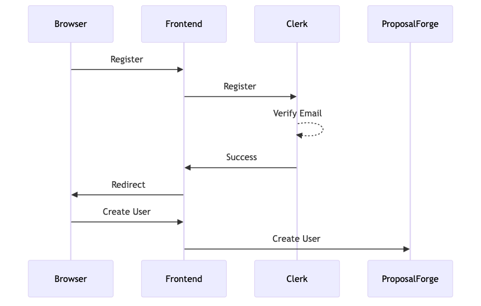
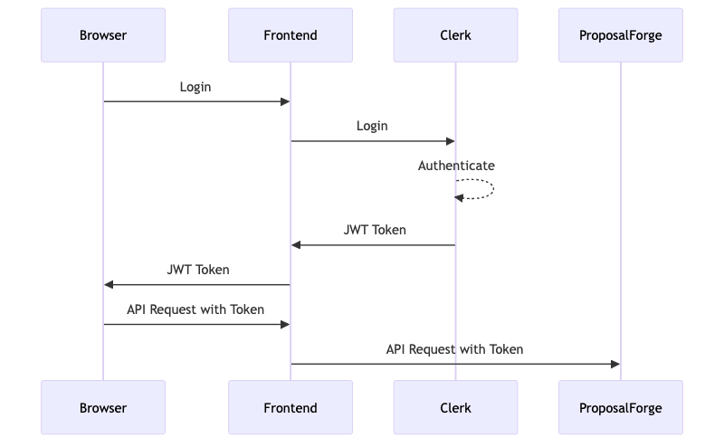
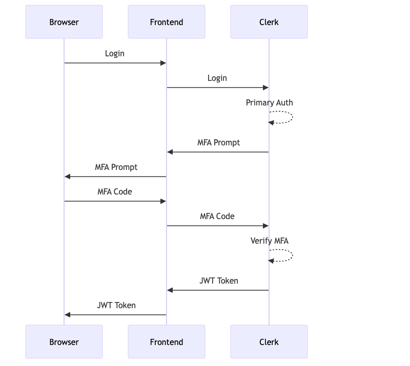

# ProposalForge Authentication Flow Documentation

## Overview

This document details the authentication flow for the ProposalForge application, covering both the MVP and Enterprise versions. The authentication system is designed to be secure, scalable, and to support the evolution from single-user to multi-user collaborative environments.

## Authentication Provider: Clerk

ProposalForge uses [Clerk](https://clerk.dev/) as the authentication provider for the following reasons:

1. **Developer Experience**: Streamlined integration with minimal boilerplate
2. **Security**: Modern security practices including MFA and session management
3. **User Management**: Built-in user management features
4. **Role-Based Access Control**: Supports role assignment and verification
5. **Scalability**: Handles authentication needs from MVP to Enterprise
6. **Branding**: Customizable to match ProposalForge UI

## Authentication Flow Diagrams

### Registration Flow



### Login Flow



### Multi-Factor Authentication (Enterprise)



## JWT Structure and Claims

The JWT (JSON Web Token) issued by Clerk contains the following claims:

```json
{
  "sub": "user_2abc...",
  "iss": "https://clerk.proposalforge.com",
  "exp": 1678901234,
  "iat": 1678900234,
  "azp": "proposalforge_client",
  "scp": ["openid", "profile", "email"],
  "auth_time": 1678900234,
  "custom_claim": {
    "userId": "550e8400-e29b-41d4-a716-446655440000",
    "email": "user@example.com",
    "role": "user"
  }
}
```

We extend the standard claims with custom claims to include the ProposalForge user ID and role information.

## Token Lifecycle

1. **Token Issuance**: Tokens are issued upon successful authentication
2. **Token Expiration**: Tokens expire after 1 hour by default
3. **Token Refresh**: The frontend automatically refreshes tokens when they are about to expire
4. **Token Revocation**: Tokens can be revoked by administrators or upon user logout

## Authentication Flow Implementation

### Frontend Implementation

```typescript
// Authentication Provider component wrapping the application
import { ClerkProvider, useAuth } from '@clerk/clerk-react';

const App = () => {
  return (
    <ClerkProvider publishableKey={process.env.REACT_APP_CLERK_PUBLISHABLE_KEY}>
      <AuthenticatedApp />
    </ClerkProvider>
  );
};

// Hook for accessing authentication state and methods
const useAuthentication = () => {
  const { isSignedIn, userId, sessionId, getToken } = useAuth();

  const fetchWithAuth = async (url, options = {}) => {
    const token = await getToken();
    return fetch(url, {
      ...options,
      headers: {
        ...options.headers,
        Authorization: `Bearer ${token}`,
      },
    });
  };

  return {
    isAuthenticated: isSignedIn,
    userId,
    sessionId,
    fetchWithAuth,
  };
};
```

### Backend Authentication Middleware

```javascript
// Authentication middleware for Express
const jwt = require('jsonwebtoken');
const { Clerk } = require('@clerk/clerk-sdk-node');

const clerk = Clerk({ apiKey: process.env.CLERK_API_KEY });

const authenticate = async (req, res, next) => {
  try {
    const authHeader = req.headers.authorization;
    
    if (!authHeader || !authHeader.startsWith('Bearer ')) {
      return res.status(401).json({ 
        code: 'unauthorized', 
        message: 'Authentication required' 
      });
    }
    
    const token = authHeader.split(' ')[1];
    
    // Verify the token with Clerk
    const session = await clerk.sessions.verifySession(token);
    
    if (!session || !session.userId) {
      return res.status(401).json({ 
        code: 'invalid_token', 
        message: 'Invalid authentication token' 
      });
    }
    
    // Fetch user from database
    const user = await db.users.findByExternalId(session.userId);
    
    if (!user) {
      return res.status(401).json({
        code: 'user_not_found',
        message: 'User not found'
      });
    }
    
    // Attach user to request
    req.user = user;
    next();
  } catch (error) {
    console.error('Authentication error:', error);
    return res.status(401).json({
      code: 'authentication_error',
      message: 'Authentication failed'
    });
  }
};

module.exports = { authenticate };
```

## Role-Based Authorization

ProposalForge implements Role-Based Access Control (RBAC) to manage permissions:

1. **System Roles**:
   - `user`: Basic user with access to their own workspaces
   - `admin`: Administrator with access to all workspaces and system settings

2. **Workspace Roles**:
   - `owner`: Full control over the workspace
   - `admin`: Can manage workspace settings and users
   - `editor`: Can edit proposal content
   - `viewer`: Read-only access to proposals

### Authorization Middleware

```javascript
// Authorization middleware for Express
const authorize = (requiredRole) => {
  return (req, res, next) => {
    // Check if user exists and has role information
    if (!req.user || !req.user.role) {
      return res.status(403).json({
        code: 'forbidden',
        message: 'Authorization failed'
      });
    }

    // Check system-level role
    if (req.user.role === 'admin' || req.user.role === requiredRole) {
      return next();
    }

    return res.status(403).json({
      code: 'insufficient_permissions',
      message: 'You do not have permission to access this resource'
    });
  };
};

// Workspace-level authorization
const authorizeWorkspace = (requiredRole) => {
  return async (req, res, next) => {
    // Check if workspace ID is provided
    const workspaceId = req.params.workspaceId;
    if (!workspaceId) {
      return res.status(400).json({
        code: 'missing_workspace_id',
        message: 'Workspace ID is required'
      });
    }

    // Check if user exists
    if (!req.user) {
      return res.status(403).json({
        code: 'forbidden',
        message: 'Authorization failed'
      });
    }

    // System admins have access to all workspaces
    if (req.user.role === 'admin') {
      return next();
    }

    // Get user's role in the workspace
    const userWorkspace = await db.userWorkspaces.findOne({
      where: {
        userId: req.user.id,
        workspaceId
      }
    });

    if (!userWorkspace) {
      return res.status(403).json({
        code: 'workspace_access_denied',
        message: 'You do not have access to this workspace'
      });
    }

    // Check workspace role
    const roleHierarchy = {
      'owner': 3,
      'admin': 2,
      'editor': 1,
      'viewer': 0
    };

    const requiredRoleLevel = roleHierarchy[requiredRole] || 0;
    const userRoleLevel = roleHierarchy[userWorkspace.role] || 0;

    if (userRoleLevel >= requiredRoleLevel) {
      // Attach workspace role to request for further checks
      req.workspaceRole = userWorkspace.role;
      return next();
    }

    return res.status(403).json({
      code: 'insufficient_workspace_permissions',
      message: 'You do not have sufficient permissions in this workspace'
    });
  };
};

module.exports = { authorize, authorizeWorkspace };
```

## Single Sign-On (Enterprise)

For the Enterprise version, ProposalForge supports Single Sign-On (SSO) with:

1. **SAML 2.0** integration for enterprise identity providers
2. **OpenID Connect** support
3. **OAuth 2.0** support for specific providers

The SSO integration is handled through Clerk's Enterprise SSO feature.

## Security Considerations

1. **HTTPS**: All communication is encrypted using TLS/SSL
2. **Token Security**:
   - Tokens are stored securely in memory and HttpOnly cookies
   - Tokens are short-lived and regularly rotated
   - CSRF protection is implemented
3. **Rate Limiting**: API endpoints are protected against brute force attacks
4. **Audit Logging**: Authentication events are logged for security monitoring
5. **Session Management**: Users can view and terminate active sessions
6. **Password Policies**: Strong password requirements and regular rotation

## Feature Flag Protection

Authentication and authorization are integrated with the feature flag system to control access to Enterprise features:

```javascript
// Feature flag middleware for Enterprise features
const checkFeatureFlag = (flagName) => {
  return async (req, res, next) => {
    // Skip check if user is an admin
    if (req.user && req.user.role === 'admin') {
      return next();
    }

    // Check if feature flag is enabled
    const isEnabled = await featureService.isFeatureEnabled(flagName, req.user.id);
    
    if (!isEnabled) {
      return res.status(403).json({
        code: 'feature_disabled',
        message: 'This feature is not available in your current plan'
      });
    }
    
    next();
  };
};

// Example usage
app.post(
  '/workspaces/:workspaceId/users',
  authenticate,
  authorizeWorkspace('admin'),
  checkFeatureFlag('enable_collaboration'),
  workspaceController.addWorkspaceUser
);
```

## Migration Path from MVP to Enterprise

The authentication system is designed to support a smooth transition from MVP to Enterprise:

1. **MVP Phase**: 
   - Basic authentication is implemented
   - User roles are established but limited functionality
   - Database schema supports future multi-user needs

2. **Enterprise Phase**:
   - Activate workspace-level roles and permissions
   - Enable SSO capabilities
   - Implement MFA requirements
   - Add organizational hierarchy
   - No changes to authentication APIs or token structure

## Testing Authentication

In development environments, test users are provided with various roles:

```javascript
// Development seed data
const testUsers = [
  {
    email: 'admin@example.com',
    name: 'Admin User',
    role: 'admin',
    externalId: 'dev_admin'
  },
  {
    email: 'user@example.com',
    name: 'Regular User',
    role: 'user',
    externalId: 'dev_user'
  }
];

const testWorkspaceUsers = [
  {
    userId: 'USER_ID_1',
    workspaceId: 'WORKSPACE_ID_1',
    role: 'owner'
  },
  {
    userId: 'USER_ID_2',
    workspaceId: 'WORKSPACE_ID_1',
    role: 'editor'
  }
];
```

A special development-only endpoint is available for impersonating different users:

```javascript
// Development-only routes
if (process.env.NODE_ENV === 'development') {
  app.post('/dev/impersonate', async (req, res) => {
    const { email } = req.body;
    
    // Find user
    const user = await db.users.findOne({ where: { email } });
    
    if (!user) {
      return res.status(404).json({
        code: 'user_not_found',
        message: 'User not found'
      });
    }
    
    // Generate development token
    const token = jwt.sign(
      { 
        sub: user.externalId,
        custom_claim: {
          userId: user.id,
          email: user.email,
          role: user.role
        }
      },
      'development-secret',
      { expiresIn: '1h' }
    );
    
    res.json({ token });
  });
}
```

## Conclusion

The ProposalForge authentication and authorization system provides a secure, scalable foundation for both the MVP and Enterprise versions. By implementing a forward-thinking design from the start, we ensure a smooth transition as the application evolves from single-user to collaborative use cases. 