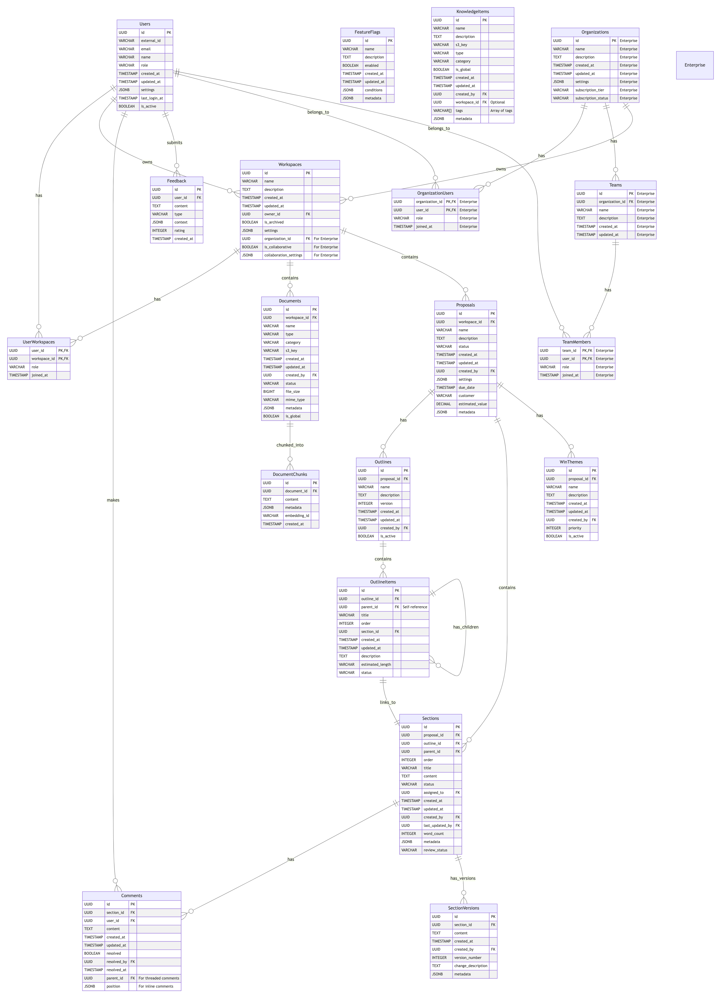

# ProposalForge Database Schema Design

## Introduction

This document outlines the database schema design for ProposalForge, detailing the data structures that will support both the MVP and Enterprise versions of the application. The schema is designed to efficiently store, retrieve, and manage the various entities and relationships within the system.

## Database Technologies

The ProposalForge application will utilize the following database technologies:

1. **PostgreSQL**: Primary relational database for structured data storage
2. **Qdrant**: Vector database for storing and querying embeddings
3. **Amazon S3**: Object storage for document files and large binary data
4. **Redis**: In-memory data structure store for caching and session management

## Database Schema Overview

The database schema for ProposalForge is centered around the core entities of the application, including Users, Workspaces, Documents, Proposals, and their interrelationships.



## PostgreSQL Schema Design

The following sections detail the PostgreSQL table definitions and relationships for the ProposalForge application.

### Users Table

The Users table stores information about system users, including their authentication details and profile information.

```sql
CREATE TABLE "Users" (
    id UUID PRIMARY KEY DEFAULT uuid_generate_v4(),
    external_id VARCHAR(255) UNIQUE,
    email VARCHAR(255) UNIQUE NOT NULL,
    name VARCHAR(255) NOT NULL,
    role VARCHAR(50) NOT NULL DEFAULT 'user',
    created_at TIMESTAMP WITH TIME ZONE DEFAULT CURRENT_TIMESTAMP,
    updated_at TIMESTAMP WITH TIME ZONE DEFAULT CURRENT_TIMESTAMP
);

CREATE INDEX idx_users_email ON "Users" (email);
CREATE INDEX idx_users_external_id ON "Users" (external_id);
```

### Workspaces Table

The Workspaces table represents project workspaces where teams collaborate on proposals.

```sql
CREATE TABLE "Workspaces" (
    id UUID PRIMARY KEY DEFAULT uuid_generate_v4(),
    name VARCHAR(255) NOT NULL,
    description TEXT,
    created_at TIMESTAMP WITH TIME ZONE DEFAULT CURRENT_TIMESTAMP,
    updated_at TIMESTAMP WITH TIME ZONE DEFAULT CURRENT_TIMESTAMP,
    owner_id UUID NOT NULL REFERENCES "Users" (id) ON DELETE CASCADE,
    is_archived BOOLEAN DEFAULT FALSE
);

CREATE INDEX idx_workspaces_owner ON "Workspaces" (owner_id);
```

### UserWorkspaces Table

The UserWorkspaces table manages the many-to-many relationship between users and workspaces, tracking user roles within each workspace.

```sql
CREATE TABLE "UserWorkspaces" (
    user_id UUID REFERENCES "Users" (id) ON DELETE CASCADE,
    workspace_id UUID REFERENCES "Workspaces" (id) ON DELETE CASCADE,
    role VARCHAR(50) NOT NULL DEFAULT 'member',
    joined_at TIMESTAMP WITH TIME ZONE DEFAULT CURRENT_TIMESTAMP,
    PRIMARY KEY (user_id, workspace_id)
);

CREATE INDEX idx_user_workspaces_user ON "UserWorkspaces" (user_id);
CREATE INDEX idx_user_workspaces_workspace ON "UserWorkspaces" (workspace_id);
```

### Documents Table

The Documents table stores metadata about documents uploaded to the system, with the actual content stored in S3.

```sql
CREATE TABLE "Documents" (
    id UUID PRIMARY KEY DEFAULT uuid_generate_v4(),
    workspace_id UUID NOT NULL REFERENCES "Workspaces" (id) ON DELETE CASCADE,
    name VARCHAR(255) NOT NULL,
    type VARCHAR(50) NOT NULL,
    category VARCHAR(50),
    s3_key VARCHAR(255) NOT NULL,
    created_at TIMESTAMP WITH TIME ZONE DEFAULT CURRENT_TIMESTAMP,
    updated_at TIMESTAMP WITH TIME ZONE DEFAULT CURRENT_TIMESTAMP,
    created_by UUID REFERENCES "Users" (id) ON DELETE SET NULL,
    status VARCHAR(50) DEFAULT 'pending'
);

CREATE INDEX idx_documents_workspace ON "Documents" (workspace_id);
CREATE INDEX idx_documents_created_by ON "Documents" (created_by);
CREATE INDEX idx_documents_category ON "Documents" (category);
CREATE INDEX idx_documents_type ON "Documents" (type);
```

### DocumentChunks Table

The DocumentChunks table stores segments of documents that have been processed for embedding and retrieval.

```sql
CREATE TABLE "DocumentChunks" (
    id UUID PRIMARY KEY DEFAULT uuid_generate_v4(),
    document_id UUID NOT NULL REFERENCES "Documents" (id) ON DELETE CASCADE,
    content TEXT NOT NULL,
    metadata JSONB,
    embedding_id VARCHAR(255),
    created_at TIMESTAMP WITH TIME ZONE DEFAULT CURRENT_TIMESTAMP
);

CREATE INDEX idx_document_chunks_document ON "DocumentChunks" (document_id);
CREATE INDEX idx_document_chunks_metadata ON "DocumentChunks" USING GIN (metadata);
```

### Proposals Table

The Proposals table represents proposal projects being developed within workspaces.

```sql
CREATE TABLE "Proposals" (
    id UUID PRIMARY KEY DEFAULT uuid_generate_v4(),
    workspace_id UUID NOT NULL REFERENCES "Workspaces" (id) ON DELETE CASCADE,
    name VARCHAR(255) NOT NULL,
    description TEXT,
    status VARCHAR(50) DEFAULT 'draft',
    created_at TIMESTAMP WITH TIME ZONE DEFAULT CURRENT_TIMESTAMP,
    updated_at TIMESTAMP WITH TIME ZONE DEFAULT CURRENT_TIMESTAMP,
    created_by UUID REFERENCES "Users" (id) ON DELETE SET NULL
);

CREATE INDEX idx_proposals_workspace ON "Proposals" (workspace_id);
CREATE INDEX idx_proposals_created_by ON "Proposals" (created_by);
CREATE INDEX idx_proposals_status ON "Proposals" (status);
```

### Outlines Table

The Outlines table stores structured outlines for proposals.

```sql
CREATE TABLE "Outlines" (
    id UUID PRIMARY KEY DEFAULT uuid_generate_v4(),
    proposal_id UUID NOT NULL REFERENCES "Proposals" (id) ON DELETE CASCADE,
    name VARCHAR(255) NOT NULL,
    description TEXT,
    version INTEGER DEFAULT 1,
    created_at TIMESTAMP WITH TIME ZONE DEFAULT CURRENT_TIMESTAMP,
    updated_at TIMESTAMP WITH TIME ZONE DEFAULT CURRENT_TIMESTAMP,
    created_by UUID REFERENCES "Users" (id) ON DELETE SET NULL
);

CREATE INDEX idx_outlines_proposal ON "Outlines" (proposal_id);
CREATE INDEX idx_outlines_created_by ON "Outlines" (created_by);
```

### OutlineItems Table

The OutlineItems table stores hierarchical structure of proposal outlines.

```sql
CREATE TABLE "OutlineItems" (
    id UUID PRIMARY KEY DEFAULT uuid_generate_v4(),
    outline_id UUID NOT NULL REFERENCES "Outlines" (id) ON DELETE CASCADE,
    parent_id UUID REFERENCES "OutlineItems" (id) ON DELETE CASCADE,
    title VARCHAR(255) NOT NULL,
    "order" INTEGER NOT NULL,
    section_id UUID REFERENCES "Sections" (id),
    created_at TIMESTAMP WITH TIME ZONE DEFAULT CURRENT_TIMESTAMP,
    updated_at TIMESTAMP WITH TIME ZONE DEFAULT CURRENT_TIMESTAMP
);

CREATE INDEX idx_outline_items_outline ON "OutlineItems" (outline_id);
CREATE INDEX idx_outline_items_parent ON "OutlineItems" (parent_id);
CREATE INDEX idx_outline_items_section ON "OutlineItems" (section_id);
```

### Sections Table

The Sections table stores content sections of a proposal.

```sql
CREATE TABLE "Sections" (
    id UUID PRIMARY KEY DEFAULT uuid_generate_v4(),
    proposal_id UUID NOT NULL REFERENCES "Proposals" (id) ON DELETE CASCADE,
    outline_id UUID REFERENCES "Outlines" (id) ON DELETE SET NULL,
    parent_id UUID REFERENCES "Sections" (id) ON DELETE CASCADE,
    "order" INTEGER,
    title VARCHAR(255) NOT NULL,
    content TEXT,
    status VARCHAR(50) DEFAULT 'draft',
    assigned_to UUID REFERENCES "Users" (id) ON DELETE SET NULL,
    created_at TIMESTAMP WITH TIME ZONE DEFAULT CURRENT_TIMESTAMP,
    updated_at TIMESTAMP WITH TIME ZONE DEFAULT CURRENT_TIMESTAMP,
    created_by UUID REFERENCES "Users" (id) ON DELETE SET NULL,
    last_updated_by UUID REFERENCES "Users" (id) ON DELETE SET NULL
);

CREATE INDEX idx_sections_proposal ON "Sections" (proposal_id);
CREATE INDEX idx_sections_outline ON "Sections" (outline_id);
CREATE INDEX idx_sections_parent ON "Sections" (parent_id);
CREATE INDEX idx_sections_assigned_to ON "Sections" (assigned_to);
CREATE INDEX idx_sections_status ON "Sections" (status);
```

### WinThemes Table

The WinThemes table stores strategic themes for proposals.

```sql
CREATE TABLE "WinThemes" (
    id UUID PRIMARY KEY DEFAULT uuid_generate_v4(),
    proposal_id UUID NOT NULL REFERENCES "Proposals" (id) ON DELETE CASCADE,
    name VARCHAR(255) NOT NULL,
    description TEXT,
    created_at TIMESTAMP WITH TIME ZONE DEFAULT CURRENT_TIMESTAMP,
    updated_at TIMESTAMP WITH TIME ZONE DEFAULT CURRENT_TIMESTAMP,
    created_by UUID REFERENCES "Users" (id) ON DELETE SET NULL
);

CREATE INDEX idx_win_themes_proposal ON "WinThemes" (proposal_id);
CREATE INDEX idx_win_themes_created_by ON "WinThemes" (created_by);
```

### Comments Table

The Comments table stores user comments on proposal sections.

```sql
CREATE TABLE "Comments" (
    id UUID PRIMARY KEY DEFAULT uuid_generate_v4(),
    section_id UUID NOT NULL REFERENCES "Sections" (id) ON DELETE CASCADE,
    user_id UUID NOT NULL REFERENCES "Users" (id) ON DELETE CASCADE,
    content TEXT NOT NULL,
    created_at TIMESTAMP WITH TIME ZONE DEFAULT CURRENT_TIMESTAMP,
    updated_at TIMESTAMP WITH TIME ZONE DEFAULT CURRENT_TIMESTAMP,
    resolved BOOLEAN DEFAULT FALSE,
    resolved_by UUID REFERENCES "Users" (id) ON DELETE SET NULL,
    resolved_at TIMESTAMP WITH TIME ZONE
);

CREATE INDEX idx_comments_section ON "Comments" (section_id);
CREATE INDEX idx_comments_user ON "Comments" (user_id);
CREATE INDEX idx_comments_resolved ON "Comments" (resolved);
```

### FeatureFlags Table

The FeatureFlags table enables feature toggling in the application.

```sql
CREATE TABLE "FeatureFlags" (
    id UUID PRIMARY KEY DEFAULT uuid_generate_v4(),
    name VARCHAR(255) UNIQUE NOT NULL,
    description TEXT,
    enabled BOOLEAN DEFAULT FALSE,
    created_at TIMESTAMP WITH TIME ZONE DEFAULT CURRENT_TIMESTAMP,
    updated_at TIMESTAMP WITH TIME ZONE DEFAULT CURRENT_TIMESTAMP
);

CREATE INDEX idx_feature_flags_name ON "FeatureFlags" (name);
CREATE INDEX idx_feature_flags_enabled ON "FeatureFlags" (enabled);
```

### KnowledgeItems Table (Enterprise Version)

The KnowledgeItems table stores organizational knowledge for proposal development.

```sql
CREATE TABLE "KnowledgeItems" (
    id UUID PRIMARY KEY DEFAULT uuid_generate_v4(),
    name VARCHAR(255) NOT NULL,
    description TEXT,
    s3_key VARCHAR(255),
    type VARCHAR(50) NOT NULL,
    category VARCHAR(50),
    is_global BOOLEAN DEFAULT FALSE,
    created_at TIMESTAMP WITH TIME ZONE DEFAULT CURRENT_TIMESTAMP,
    updated_at TIMESTAMP WITH TIME ZONE DEFAULT CURRENT_TIMESTAMP,
    created_by UUID REFERENCES "Users" (id) ON DELETE SET NULL
);

CREATE INDEX idx_knowledge_items_type ON "KnowledgeItems" (type);
CREATE INDEX idx_knowledge_items_category ON "KnowledgeItems" (category);
CREATE INDEX idx_knowledge_items_is_global ON "KnowledgeItems" (is_global);
```

### SectionVersions Table

The SectionVersions table tracks version history of proposal sections.

```sql
CREATE TABLE "SectionVersions" (
    id UUID PRIMARY KEY DEFAULT uuid_generate_v4(),
    section_id UUID NOT NULL REFERENCES "Sections" (id) ON DELETE CASCADE,
    content TEXT NOT NULL,
    created_at TIMESTAMP WITH TIME ZONE DEFAULT CURRENT_TIMESTAMP,
    created_by UUID REFERENCES "Users" (id) ON DELETE SET NULL,
    version_number INTEGER NOT NULL
);

CREATE INDEX idx_section_versions_section ON "SectionVersions" (section_id);
CREATE INDEX idx_section_versions_created_by ON "SectionVersions" (created_by);
CREATE INDEX idx_section_versions_version_number ON "SectionVersions" (version_number);
```

### Feedback Table

The Feedback table collects user feedback on AI-generated content.

```sql
CREATE TABLE "Feedback" (
    id UUID PRIMARY KEY DEFAULT uuid_generate_v4(),
    user_id UUID NOT NULL REFERENCES "Users" (id) ON DELETE CASCADE,
    content TEXT NOT NULL,
    type VARCHAR(50) NOT NULL,
    context TEXT,
    rating INTEGER,
    created_at TIMESTAMP WITH TIME ZONE DEFAULT CURRENT_TIMESTAMP
);

CREATE INDEX idx_feedback_user ON "Feedback" (user_id);
CREATE INDEX idx_feedback_type ON "Feedback" (type);
CREATE INDEX idx_feedback_rating ON "Feedback" (rating);
```

## Vector Database Design (Qdrant)

Qdrant will be used to store and query vector embeddings for semantic search functionality. The following collections will be created:

### DocumentChunks Collection

- **Name**: document_chunks
- **Vector Dimension**: 1536 (for OpenAI embeddings)
- **Metadata**: Document ID, Chunk ID, Content text, Created timestamp

### KnowledgeItems Collection (Enterprise)

- **Name**: knowledge_items
- **Vector Dimension**: 1536 (for OpenAI embeddings)
- **Metadata**: Item ID, Name, Description, Type, Category, Global flag

## Object Storage Design (Amazon S3)

Amazon S3 will be used to store uploaded documents and files. The following bucket structure will be implemented:

- **Bucket Name**: proposalforge-{environment}
- **Folders**:
  - `/documents/{workspace_id}/{document_id}` - Original document files
  - `/exports/{workspace_id}/{proposal_id}` - Exported proposal files (PDF, DOCX)
  - `/knowledge/{item_id}` - Knowledge base items (Enterprise)
  - `/temp/{uuid}` - Temporary storage for processing

## Caching Design (Redis)

Redis will be used for caching and session management with the following key structures:

- **Session Data**: `session:{session_id}`
- **User Cache**: `user:{user_id}`
- **Document Metadata Cache**: `doc_meta:{document_id}`
- **Rate Limiting**: `rate_limit:{user_id}:{endpoint}`
- **Feature Flags**: `feature_flags`

## Database Migrations

The project will use a migration tool (e.g., Alembic with SQLAlchemy) to manage database schema evolution over time. Migration scripts will be version-controlled and applied sequentially to ensure consistent database schema across all environments.

## Backup and Recovery Strategy

The database backup strategy includes:

- Daily full PostgreSQL backups with point-in-time recovery
- S3 cross-region replication
- Regular backup testing and validation
- 30-day retention policy for backups

## Enterprise Scaling Considerations

For the Enterprise version, additional scaling considerations include:

- Read replicas for PostgreSQL to handle increased query load
- Database sharding for large organizations
- Multi-AZ deployment for high availability
- Automated scaling policies based on usage metrics 