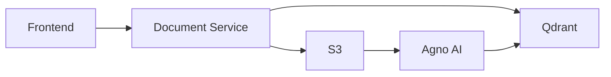
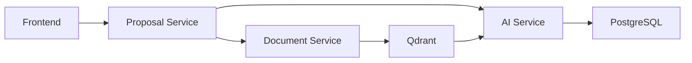
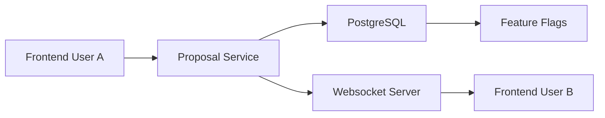
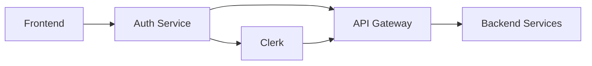
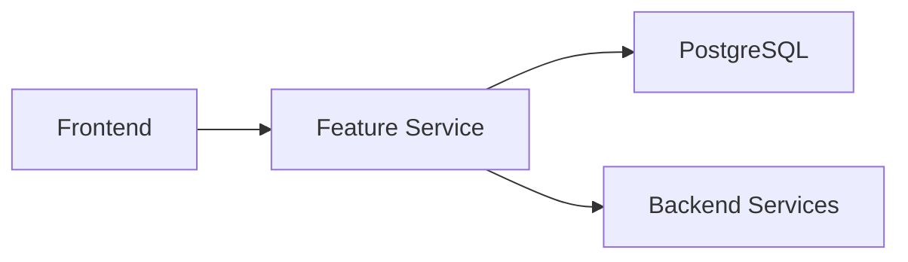

# ProposalForge System Architecture Document

## Overview

This document outlines the complete system architecture for ProposalForge, describing how the various components interact to deliver both the MVP and Enterprise versions. The architecture is designed to be modular, scalable, and enable a smooth transition from MVP to Enterprise without major refactoring.

## Core Architecture Principles

- **API-First Design**: All functionality is exposed through well-defined APIs
- **Loose Coupling**: Components interact through clean interfaces
- **Service Orientation**: Functionality is divided into discrete services
- **Feature Isolation**: Enterprise features are isolated behind feature flags
- **Security by Design**: Authentication and authorization are foundational
- **Scalability**: Architecture supports growth from individual users to organizations

## High-Level System Architecture

The ProposalForge system consists of the following major components:

```mermaid
flowchart TD
    subgraph SystemArch["ProposalForge System Architecture"]
        subgraph Frontend
            WebFrontend["Web Frontend\n(React + Vite)"]
        end
        
        subgraph BackendLayer
            BackendServices["Backend Services\n(Express.js)"]
            AuthService["Auth Service\n(Clerk)"]
        end
        
        subgraph MiddlewareLayer
            APIGateway["API Gateway"]
            ServiceRegistry["Service Registry"]
        end
        
        subgraph ServicesLayer
            DocumentService["Document Service"]
            ProposalService["Proposal Service"]
            KnowledgeService["Knowledge Base Service"]
            AIService["AI Service\n(LLM)"]
            AnalyticsService["Analytics Service"]
            ExportService["Export Service"]
        end
        
        WebFrontend <--> BackendServices
        WebFrontend <--> APIGateway
        BackendServices <--> ServiceRegistry
        APIGateway <--> ServiceRegistry
        AuthService --> APIGateway
        
        APIGateway --> ServicesLayer
        
        DocumentService --> AIService
        ProposalService --> AIService
        KnowledgeService --> AIService
    end
    
    subgraph DataLayer["Data Layer"]
        PostgreSQL["PostgreSQL\n(RDS)"]
        Qdrant["Qdrant\n(Vector DB)"]
        S3["S3\n(Document Storage)"]
        Redis["Redis\n(Cache)"]
    end
    
    ServicesLayer --> DataLayer
</flowchart>
```

### Component Descriptions

1. **Web Frontend**: React single-page application with material design components, responsible for user interactions and UI rendering.

2. **Backend Services**: Express.js application that handles API requests, orchestrates business logic, and provides services to the frontend.

3. **Auth Service**: Clerk-based authentication service that manages user identity, authentication flows, and session management.

4. **API Gateway**: Routes requests to appropriate services and handles cross-cutting concerns like rate limiting and monitoring.

5. **Service Registry**: Tracks available services and their endpoints for service discovery.

6. **Document Service**: Manages document uploads, storage, processing, and retrieval. Interfaces with S3 for storage and Agno AI for document processing.

7. **Proposal Service**: Manages proposal workspace creation, outline management, content collaboration, and section management.

8. **Knowledge Base Service**: Manages universal knowledge base access, search, and retrieval across workspaces.

9. **AI Service**: Integrates with OpenAI to provide LLM capabilities for chat, content generation, and review functionalities.

10. **Analytics Service**: Captures usage metrics, generates reports, and provides insights on system usage.

11. **Export Service**: Handles document generation and export to various formats for final proposal delivery.

12. **Data Layer**: Composed of various datastores:
    - **PostgreSQL**: Relational database for structured data like users, proposals, and outlines
    - **Qdrant**: Vector database for document embeddings and semantic search
    - **S3**: Object storage for uploaded and generated documents
    - **Redis**: Caching layer for improving performance

## Key Data Flows

### 1. Document Upload and Processing Flow



1. User uploads document via frontend
2. Document Service receives file and metadata
3. Document is stored in S3
4. Document is sent to Agno AI for processing (text extraction, chunking)
5. Document vectors/embeddings are stored in Qdrant
6. Document metadata is stored in PostgreSQL

### 2. Outline Generation Flow



1. User requests outline generation via frontend
2. Proposal Service processes request
3. Document Service retrieves relevant documents from workspace
4. Qdrant provides vector search results for context
5. AI Service generates outline using LLM with context
6. Generated outline is stored in PostgreSQL
7. Outline is returned to frontend for display/editing

### 3. Collaborative Editing Flow (Enterprise)



1. User A makes edits to a proposal section
2. Proposal Service processes updates
3. Changes are stored in PostgreSQL
4. If collaborative editing is enabled (feature flag)
5. Websocket Server broadcasts changes
6. User B receives real-time updates

### 4. Authentication Flow



1. User initiates login via frontend
2. Auth Service directs to Clerk
3. Clerk handles authentication, MFA, etc.
4. Auth token is returned to frontend
5. Token is included in subsequent API requests
6. API Gateway validates tokens
7. Backend services enforce authorization

## Component Interactions

### Frontend to Backend Integration

The frontend interacts with the backend through RESTful APIs and WebSocket connections:

- **RESTful APIs**: Used for CRUD operations, data retrieval, and command execution
- **WebSockets**: Used for real-time updates and collaborative features
- **File Upload**: Multi-part form data for document uploads with progress tracking

API endpoints follow this structure:
- `/api/v1/proposals` - Proposal management
- `/api/v1/documents` - Document management
- `/api/v1/knowledge` - Knowledge base access
- `/api/v1/ai` - AI-assisted operations
- `/api/v1/admin` - Administrative functions

### Service-to-Service Communication

Services communicate with each other through:

- **Direct API calls**: Synchronous requests between services
- **Message queue** (future enhancement for Enterprise): Asynchronous communication for background tasks
- **Event bus** (future enhancement for Enterprise): Publish-subscribe pattern for event-driven architecture

### Data Storage Partitioning

Data is partitioned across storage systems based on type and access patterns:

1. **PostgreSQL**:
   - User accounts and profiles
   - Proposal metadata (names, dates, status)
   - Outline structures
   - Section content and revision history
   - Comments and feedback
   - System configuration

2. **Qdrant**:
   - Document embeddings for semantic search
   - Chunked content for contextual retrieval
   - Vector representations of knowledge bases

3. **S3**:
   - Original uploaded documents
   - Generated export files
   - Large binary assets

4. **Redis**:
   - Session cache
   - Frequently accessed data
   - Rate limiting counters
   - Real-time collaboration state

## Feature Flag Architecture

The feature flag system enables progressive activation of Enterprise features:



- Feature flags are stored in PostgreSQL
- Feature Service provides centralized access to flag status
- Frontend conditionally renders UI elements based on enabled features
- Backend services conditionally enable functionality based on feature status
- Admin interface allows toggling features for testing and gradual rollout

## Deployment Architecture

ProposalForge is deployed on AWS with the following architecture:

```mermaid
flowchart TD
    subgraph AWS
        CloudFront --> S3Frontend["S3\n(Frontend)"]
        
        Route53 --> ALB
        ALB --> EC2Autoscale["EC2\n(Autoscale)"]
        
        EC2Autoscale --> S3Documents["S3\n(Documents)"]
        EC2Autoscale --> RDS["RDS\n(PostgreSQL)"]
        EC2Autoscale --> ElastiCache["ElastiCache\n(Redis)"]
        EC2Autoscale --> EC2Qdrant["EC2\n(Qdrant)"]
        
        CloudWatch
    end
    
    OpenAI["OpenAI API"] <--> EC2Autoscale
    ClerkAPI["Clerk API"] <--> EC2Autoscale
</flowchart>
```

### Development Environment

- Frontend: Local development with Vite
- Backend: EC2 t3.medium instance
- Database: RDS PostgreSQL t3.medium
- Vector DB: EC2 t3.large running Qdrant
- Cache: ElastiCache t3.small
- Storage: S3 buckets with dev prefix

### Production Environment

- Frontend: S3 + CloudFront CDN
- Backend: Multiple EC2 instances in Auto Scaling Group behind ALB
- Database: RDS PostgreSQL r6g.large with read replicas
- Vector DB: EC2 r6g.xlarge for Qdrant
- Cache: ElastiCache m6g.large in cluster mode
- Storage: S3 buckets with production lifecycle policies

## Scalability and Performance Considerations

The architecture addresses scalability through:

1. **Horizontal Scaling**:
   - Stateless backend services can scale horizontally
   - Auto-scaling groups adjust to demand
   - Read replicas for database read scaling

2. **Caching Strategy**:
   - Redis caches frequent queries
   - CloudFront caches static assets
   - Application-level caching for expensive operations

3. **Performance Optimizations**:
   - Pagination for large result sets
   - Optimized database queries with proper indexing
   - Lazy loading of UI components
   - Efficient document chunking for vector search

## Security Architecture

Security is implemented at multiple layers:

1. **Network Level**:
   - VPC with public and private subnets
   - Security groups with least privilege
   - WAF for common attack protection

2. **Application Level**:
   - Token-based authentication
   - Role-based access control
   - Input validation and sanitization
   - CSRF protection
   - Content Security Policy

3. **Data Level**:
   - Encryption at rest for all datastores
   - TLS for data in transit
   - Proper access controls to S3 buckets
   - Secure handling of credentials (AWS Secrets Manager)

## Monitoring and Observability

The system includes comprehensive monitoring:

1. **Infrastructure Monitoring**:
   - CloudWatch metrics for AWS resources
   - Health checks for service availability
   - Resource utilization tracking

2. **Application Monitoring**:
   - Custom metrics for business processes
   - Request/response timing
   - Error rates and types
   - User activity patterns

3. **Logging**:
   - Centralized logging with CloudWatch Logs
   - Structured log format for easy querying
   - Log retention policies
   - Sensitive data filtering

## Disaster Recovery

The system implements disaster recovery through:

1. **Backup Strategy**:
   - Daily RDS automated backups
   - S3 versioning and cross-region replication
   - Regular vector database dumps
   - Configuration backup via Infrastructure as Code

2. **Recovery Procedures**:
   - RDS point-in-time recovery
   - Deployment rollback capabilities
   - Service restart procedures
   - Data reconciliation processes

## MVP to Enterprise Evolution

The architecture facilitates evolution from MVP to Enterprise through:

1. **Component Isolation**:
   - Clear interfaces between components
   - Enterprise features contained within specific services

2. **Feature Flagging**:
   - Collaborative features deployed but inactive in MVP
   - Progressive activation of Enterprise capabilities

3. **Database Schema Design**:
   - Multi-user support in schema from the beginning
   - Tenant isolation patterns

4. **Frontend Component Design**:
   - UI components built with extensibility in mind
   - Conditional rendering based on feature availability

## Next Steps

1. **Detailed API Specification**:
   - Document all API endpoints
   - Define request/response formats
   - Establish error handling patterns

2. **Database Schema Design**:
   - Define table structures
   - Establish relationships
   - Document indexes and constraints

3. **UI Component Library**:
   - Define reusable UI components
   - Establish style guide
   - Document component interactions

4. **Infrastructure as Code**:
   - Define AWS resources
   - Create deployment pipelines
   - Document environment provisioning
